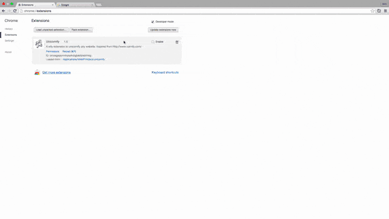

## unicornify-extension
A Chrome WebExtension to unicornify any website.

- Inspired by videocast: http://www.paulirish.com/2010/10-things-i-learned-from-the-jquery-source/
- Source code from: http://www.cornify.com/js/cornify.js

## Demo

## Usage
1. To install, download a zipped copy. Unzipped the files.
2. Then, go to your Chrome browser extensions via [Preferences]. For Mac, press `cmd + ,` > click [Extensions] > check [Developer Mode] > click [Load unpacked extension].
3. Select your unzipped folder and unicornify-extension should install.
4. Go to any website, click the Unicornify button on top right of your browser window to unicornify!

## Issues
1. Too much rainbows.

## Todo
1. Stare.
2. Click.
3. Stare.
4. Repeat.

## License
unicornify-extension is licensed under the MIT license. (http://opensource.org/licenses/MIT)

## Contributing
Feel free to contribute.
